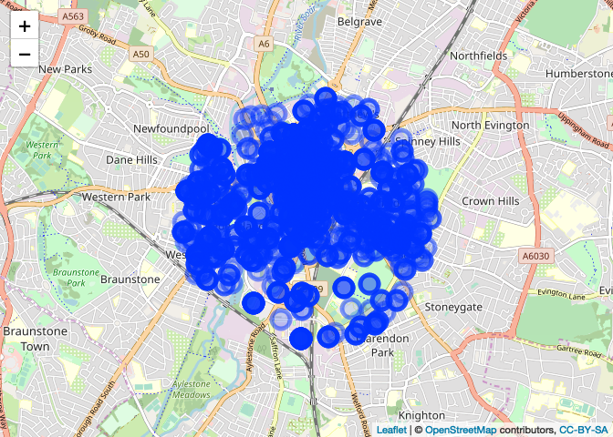

<!-- README.md is generated from README.Rmd. Please edit that file -->

# ukpolice 

[](https://ci.appveyor.com/project/njtierney/ukpolice)[](https://travis-ci.org/njtierney/ukpolice)[](https://codecov.io/github/njtierney/ukpolice?branch=master)

ukpolice is an R package that facilitates retrieving data from the [UK
police database.](https://data.police.uk/). The data provided by the API
contains public sector information licensed under the [Open Government
Licence
v3.0.](http://www.nationalarchives.gov.uk/doc/open-government-licence/version/3/)

*hex sticker police logo “Police” created by Yu luck from the Noun
Project, hex sticker made with
[hexSticker](https://github.com/GuangchuangYu/hexSticker) package*

# Installation

Install from GitHub

``` r

#install.packages("remotes")
remotes::install_github("njtierney/ukpolice")
```

# Get the crime data with `ukp_crime`

`ukp_crime()` draws crimes from within a one mile radius of the
location. When no date is specified, it uses the latest month available,
which can be found using `ukp_last_update()`.

``` r
library(ukpolice)

crime_data <- ukp_crime(lat = 52.629729, lng = -1.131592)
#> No encoding supplied: defaulting to UTF-8.

head(crime_data)
#> # A tibble: 6 x 12
#>   category  persistent_id date    lat  long street_id street_name  context
#>   <chr>     <chr>         <chr> <dbl> <dbl> <chr>     <chr>        <chr>  
#> 1 anti-soc… ""            2018…  52.6 -1.13 882346    On or near … ""     
#> 2 anti-soc… ""            2018…  52.6 -1.13 883351    On or near … ""     
#> 3 anti-soc… ""            2018…  52.6 -1.13 883408    On or near … ""     
#> 4 anti-soc… ""            2018…  52.6 -1.13 883313    On or near … ""     
#> 5 anti-soc… ""            2018…  52.6 -1.11 882420    On or near … ""     
#> 6 anti-soc… ""            2018…  52.6 -1.13 882336    On or near … ""     
#> # ... with 4 more variables: id <chr>, location_type <chr>,
#> #   location_subtype <chr>, outcome_status <chr>

ukp_last_update()
#> No encoding supplied: defaulting to UTF-8.
#> [1] "2018-03"
```

## Specify a month and year for data

When date is specified, it must be in the format “YYYY-MM”. Currently
`ukp_crime()` only allows for searching of that current month.

``` r

crime_data_date <- ukp_crime(lat = 52.629729, 
                             lng = -1.131592,
                             date = "2016-03")
#> No encoding supplied: defaulting to UTF-8.

head(crime_data_date)
#> # A tibble: 6 x 12
#>   category  persistent_id date    lat  long street_id street_name  context
#>   <chr>     <chr>         <chr> <dbl> <dbl> <chr>     <chr>        <chr>  
#> 1 anti-soc… ""            2016…  52.6 -1.14 882313    On or near … ""     
#> 2 anti-soc… ""            2016…  52.6 -1.12 883287    On or near … ""     
#> 3 anti-soc… ""            2016…  52.6 -1.15 883538    On or near … ""     
#> 4 anti-soc… ""            2016…  52.6 -1.13 883415    On or near … ""     
#> 5 anti-soc… ""            2016…  52.6 -1.14 883525    On or near … ""     
#> 6 anti-soc… ""            2016…  52.6 -1.14 883433    On or near … ""     
#> # ... with 4 more variables: id <chr>, location_type <chr>,
#> #   location_subtype <chr>, outcome_status <chr>
```

This is still a little buggy at the moment as it returns blank columns
for variables like `persistent_id` and `context`, `location_subtype`,
and `outcome_status`. This issue is currently logged at [issue
\#11](https://github.com/njtierney/ukpolice/issues/11).

# Example usage

## Explore the number of crime types

``` r

library(dplyr)
#> 
#> Attaching package: 'dplyr'
#> The following objects are masked from 'package:stats':
#> 
#>     filter, lag
#> The following objects are masked from 'package:base':
#> 
#>     intersect, setdiff, setequal, union
library(ggplot2)

crime_data <- ukp_crime(lat = 52.629729, lng = -1.131592)
#> No encoding supplied: defaulting to UTF-8.

crime_data %>%
  count(category) %>%
  ggplot(aes(x = reorder(category, n),
             y = n)) + 
  geom_col() + 
  labs(x = "Crime Type",
       y = "Number of Crimes",
       title = paste0("Crimes commited in ",crime_data_date$date[1])) +
  coord_flip() +
  theme_minimal()
```

<!-- -->

## Using leaflet

You can add a popup that displays the crime type using the `popup`
argument in leaflet.

``` r
library(leaflet)
crime_data <- ukp_crime(lat = 52.629729, lng = -1.131592)
#> No encoding supplied: defaulting to UTF-8.
crime_data %>%
  leaflet() %>%
  addTiles() %>%
  addCircleMarkers(popup = ~category)
#> Assuming "long" and "lat" are longitude and latitude, respectively
```

<!-- -->

# Other use of ukpolice

ukpolice does other things\! At the moment other features include:

  - Get crime within a polygon with `ukp_crime_poly()`
  - Retrieve a list of neighbourhoods for a police force with
    `ukp_neighbourhood()`

To see these examples, read the vignette “Getting Started with
ukpolice”.

## Code of Conduct

Please note that this project is released with a [Contributor Code of
Conduct](CONDUCT.md). By participating in this project you agree to
abide by its terms.
